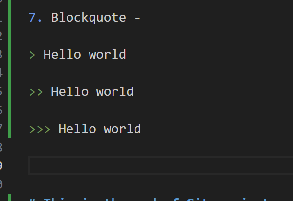

# Git Project

## This project shows the implemetation of basic git commands.

- Step 1: I created a directory named GitProject on git bash, then moved into the directory and used git init to make it a local repository.

- Step 2: Making commit - I created a textfile called aws.txt, then editted and save it with nano command. Afterwards, I used the git add command to track the file to the staging area and then committed it using the commit message "Git-Workspace"  

- Step 3: Working with branches - Branches allow you to work on different parts of a project without impacting the main branch. 

- I created a new branch named "new-branch" with 'git checkout -b new-branch' and created another branch named Update-landing-page with 'git branch Update-landing-page' command.

- Step 4: Listing new branch - I used the command 'git branch' to list all existing branches

- Step 5: Changing to old branch - Two commands were used to change the branches 
- a) 'git checkout new-branch'
- b) 'git switch Update-landing-page'

- Step 6: Merging a branch into another branch - the 'git merge' command was used to merge branch main with Update-landing-page and new-branch

- Step 7: Deleting branch - the git branch -d command was used to delete Update-landing-page

- Step 8: Cloning remote git repository - The 'git clone' command helps us make a copy of remote repository on our local machine.

- The command is 'git clone (link to your remote repository)'

- Step 9: Introduction to Markdown syntax

1. Headings - he hashtag or pound symbol (#) is used to create headings. The number of hashtags indicates the level of the heading. For example:

One hashtag (#) creates a level 1 heading.
Two hashtags (##) create a level 2 heading.
Three hashtags (###) create a level 3 heading, and so on.
 
 - Example below

# Hello

## Hello

### Hello 

#### Hello

 2.  Emphasis - Asterisk or underscore is used to emphasize text
 
 - In Visual Studio Code's Markdown, the asterisk (*) is often used as a syntax element to create various formatting styles. The specific function of the asterisk can vary depending on how it is used. Here are some common use cases:

Italic Text:

Syntax: *italic* or _italic_
Example: *Hello world* _Hello world_
        
Bold Text:

Syntax: **bold** or __bold__
Example: **Hello world** __Hello world__

3. Lists - Markdown has support for both ordered and unordered list.

## Ordered list

1. First item

2. Second item 

3. Third item

## Unordered list 

- Item 1 

- Item 2

* Item 3 

* Item 4

4. Links - To create a hyperlink, use square brackets for the linktext followed by parantheses contain the URL

* Example: [visit dare.io](htttps://www.google.com)

5. Images - To display an image, use an exclamation mark followed by square brackets for the alt text and parentheses containing the image URL

E.g > 

6. Code - To dispaly code or code snippets, use backticks (Hello) to enclose the code
E.g console.log ('welcome to darey.io')

7. Blockquote - 

> Hello world

>> Hello world

>>> Hello world

# This is the end of Git project

