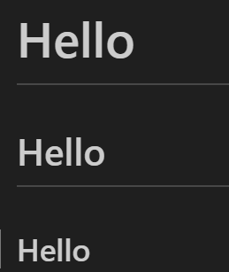

# Git Project

## This project shows the implemetation of basic git commands.

- Step 1: I created a directory named GitProject on git bash, then moved into the directory and used git init to make it a local repository.

- Step 2: Making commit - I created a textfile called aws.txt, then editted and save it with nano command. Afterwards, I used the git add command to track the file to the staging area and then committed it using the commit message "Git-Workspace"  

- Step 3: Working with branches - Branches allow you to work on different parts of a project without impacting the main branch. 

- I created a new branch named "new-branch" with 'git checkout -b new-branch' and created another branch named Update-landing-page with 'git branch Update-landing-page' command.

- Step 4: Listing new branch - I used the command 'git branch' to list all existing branches

- Step 5: Changing to old branch - Two commands were used to change the branches 
- a) 'git checkout new-branch'
- b) 'git switch Update-landing-page'

- Step 6: Merging a branch into another branch - the 'git merge' command was used to merge branch main with Update-landing-page and new-branch

- Step 7: Deleting branch - the git branch -d command was used to delete Update-landing-page

- Step 8: Cloning remote git repository - The 'git clone' command helps us make a copy of remote repository on our local machine.
- The command is git clone <link to your remote repository>

- Step 9: Markdown syntax

- a) Headings

# Hello

## Hello

### Hello 

