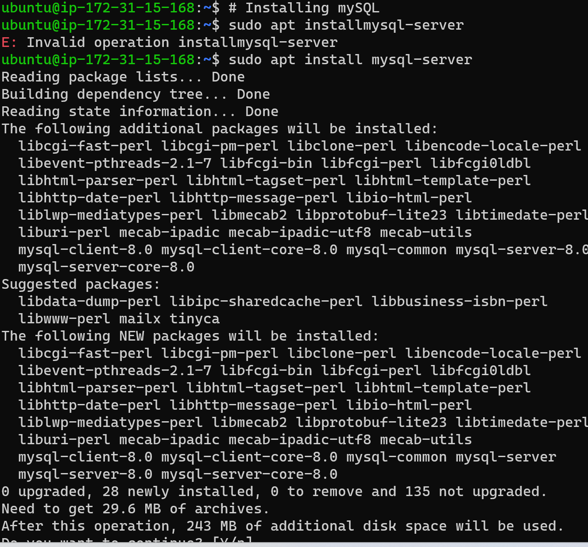

# This is Web stack Implementation (LAMP STACK)

## Step 1 - Installing Apache 

- Apache HTTP Server is the most widely used Web server. The first step is to use the Ubuntu's package manager 'apt' to install Apache on the EC2 instance that was provisioned on Amazon Web Service and update the firewall

- To install Apache 'sudo apt install apache2'

- To update the firewall, 'sudo apt update'

- To confirm that apache2 is running, 'sudo systemctl status apache2'

- Before the web server can recieve any traffic, TCP Port 80 which is the default port that web browsers use to access web pages has to be opened. TCP port 22 has been opened by default to enable access via SSH, but EC2 configuration rule has to be added to open inbound connection through port 80.

- To test local access on Ubuntu shell 'curl http://localhost:80' or 'curl http://127.0.0.1:80' can request the Apache HTTP server over port 80.

- The image above shows that the Apache server responded to the 'curl' command with some payload.

## Step 2 - Installing MySQL

- Now that the web server is up and running, the next thing is to install a *Database Management Sytem (DBMS)* for data storage and management in a relatioanl database. MySQL is a relational database management system used within PHP environments. Again, the Ubuntu's package manager 'apt' will be used to install MySQL.

- To install MySQL 'sudo apt install mysql-server' and confirm installation by typing 'Y' and press the 'enter' key

- After installation, login to mysql console to connect MySQL server as an administrative user **root**

- The image above shows successful login into MySQL

- It is recommended to run a security script which comes pre-installed with MySQL. This script will remove some insecure default settings and lock down access to the database system. A **root** user password will be set before the script using *mysql_native_password* as the default passwword and defining the user's pasword as 'PassWord.1'. See image below

- We need to exit MySQL shell before running the interactive script described above

- Running the interactive script

- However for the purpose of this project, validation password was not set.

## Step 3 - Installing PHP

- Now that Apache has been installed to serve content and MySQL installed to store and manage the Database, PHP is the component of the setup that will process the code to display dynamic content to the end user. 

- In addition to the php package, a PHP module 'php-mysql' that allows PHP to communicate with MySQL-based databases needs to be installed. 

- Core PHP packages will be automatically installed as dependencies but 'libapache2-mod-php' also needs to be installed to enable Apache to handle PHP files.

- The three packages can be installed at once using the following command 'sudo apt install php libapache2-mod-php php-mysql'

- To confirm the PHP version ''

- At this point, the LAMP Stack is completely installed and fully operational

## Step 4 - Creating a virtual host for website using Apache

- This project will set up a domain called ProjectLamp; Apache on Ubuntu 20.04 has one server block enabled by default that is configured to serve documents from the **var/www/html** directory. 

- We will leave that directory and create another directory called "ProjectLamp" with 'sudo mkdir /var/www/ProjectLamp' command

- The next thing is to assign ownership to the directory with the $USER environment variable, which will reference the current system user. 

- The command 'sudo chown -R $USER:$USER /var/www/ProjectLamp' was used, see image below:

- The next thing is to create and open a new configuration file in Apache's "sites-avalaible" directory using either of the command-line-editor ('vi' or 'vim' they are basically the same) configurtion file

- The command 'sudo vi /etc/apache2/sites-available/ProjectLamp.conf' will create a new blank file and we will write the configuration in it.

- The image above shows that the ProjectLamp.conf file has been successfully created in the **sites-available** directory.

- The image above shows the configuration of ProjectLamp which tells Apache to serve ProjectLamp using **/var/www/ProjectLamp** as its web root directory.  

- The next step is to use 'sudo a2ensite ProjectLamp' command to enable the new virtual host.

- The next step is use the command 'sudo a2dissite 000-default' to disable the default website that that comes installed with Apache. This is required if a custom domain is not been used, otherwise Apache's default configuration would overwrite the Virtual Host

- The next step is to use the command 'sudo apache2ctl configtest' to confirm that the configuration files does not contain syntax errors. The image below shows that the syntax is ok

- The final step is to use the command 'sudo systemctl reload apache2' to reload Apache so that the changes can take effect. 

- The new website is now active but the web root **/var/www/ProjectLamp** is still empty. An index.html file will be created in that location to test the Virtual Host.

