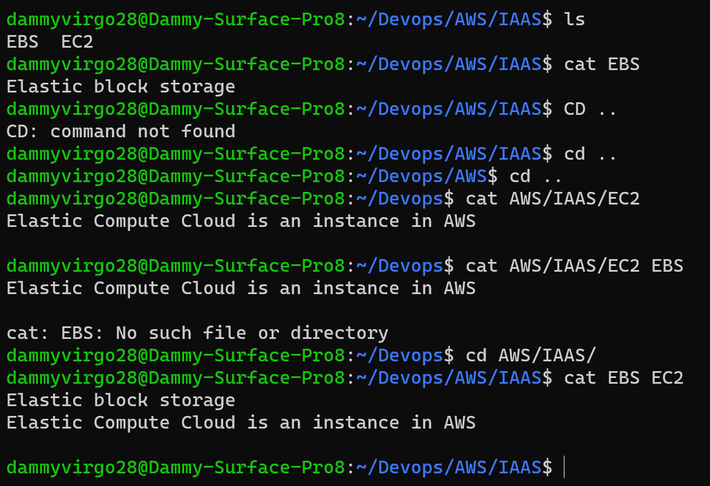

# Step 1 - Sudo command"

'sudo apt upgrade'

# Step 2 - Present working Directory" 

'pwd'

# Step 3 - Changing directory"

'cd'

# Step 4 - ls command

# Step 5 - cat command

# step 6 - cp command

# step 7 - mv command

