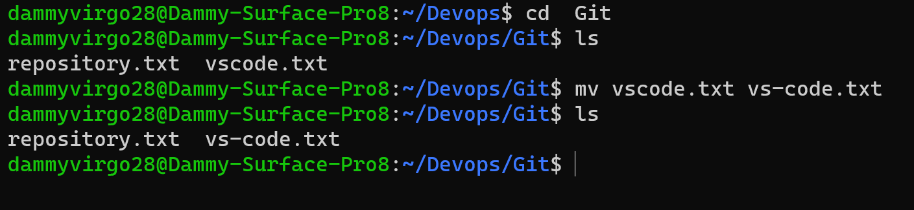
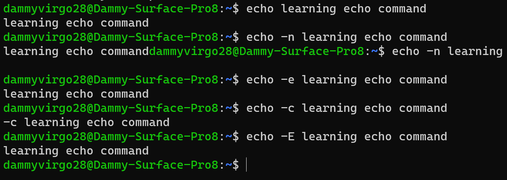
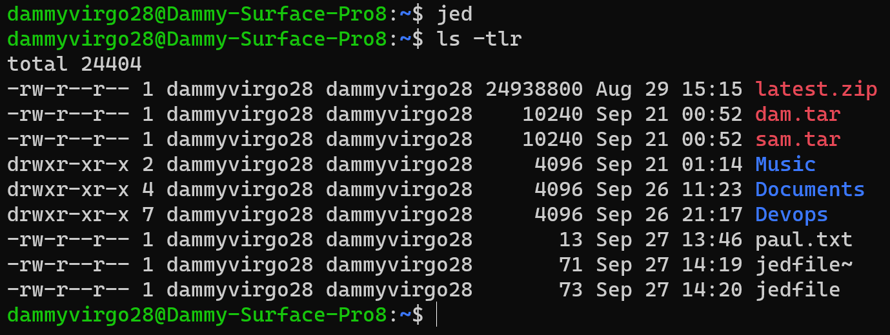

# Step 1 - Sudo command"

'sudo apt upgrade'

# Step 2 - Present working Directory" 

'pwd'

# Step 3 - Changing directory"

'cd'

# Step 4 - ls command

# Step 5 - cat command

# step 6 - cp command

# step 7 - mv command

# Step 8 - mkdir command

# Step 9 - rmdir command

# Step 10 - rm command

# Step 11 - touch command

# Step 12 - locate command

# locate *content did not work

# Step 13 - find command 

# Step 14 - grep cammand

# Step 15 - df command

# Step 16 - du command 

# Step 17 - head command

# Step 18 - tail command

# step 19 - diff command

# Step 20 - tar command

# Step 21 - chmod command

# step 22 - chown command 

# Step 23 - jobs cammand

# Step 24 - KILL COOMAND

# Step 25 - ping command

# Step 26 - wget command

 # Step 27 - uname command

# Step 28 - top command

# Step 29 - history  command

# Step 30 - man command

# Step 31 - echo command 

# Step 32 - zip and unzip commands

# Step 33 - hostname command

# Step 34 - useradd and userdel commands

# Step 35 - apt-get command

# Step 36 - nano, vi and jed commands

# Step 37 - alias and unalias commands

# Step 38 - su (switch user)

.png>)

# Step 39 -htop command

# Step 40 - ps command

# THIS IS THE END OF LINUX PROJECT
