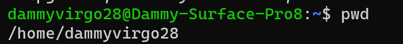
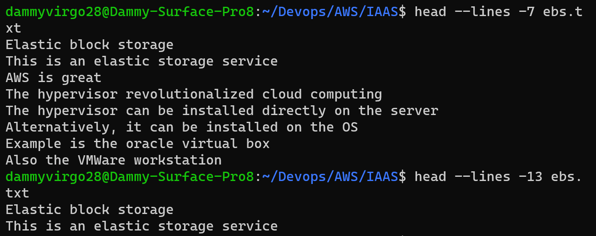

# Step 1 - Sudo command"

'sudo apt upgrade'

# Step 2 - Present working Directory" 

'pwd'

# Step 3 - Changing directory"

'cd'

# Step 4 - ls command

# Step 5 - cat command

# step 6 - cp command

# step 7 - mv command

# Step 8 - mkdir command

# Step 9 - rmdir command

# Step 10 - rm command

# Step 11 - touch command

# Step 12 - locate command

# locate *content did not work

# Step 13 - find command 

# Step 14 - grep cammand

# Step 15 - df command

# Step 16 - du command 

# Step 17 - head command

